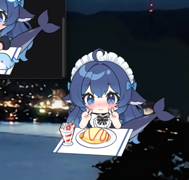

# dsh-pet-live2d-desktop

**把 [dsh-live2d-pet](../dsh-live2d-pet/) 这只桌宠从 DSH 的网页搬到你自己的桌面上** ——
一只真的站在桌面上、不挡其它窗口、跟着 DSH 会话状态换动作的 Live2D 宠物。

**发出去的是一个文件：`DSH桌宠.exe`（95 MB，不用安装）。** 双击就跑：不需要装
Node、不需要装 DSH、不需要装插件 —— 宠物本体（模型 + 贴图 + 动作）就嵌在 exe 里。

<p align="center">
  
  <br>
  <sub>屏幕实拍：只有角色吃鼠标事件，方形画布的透明处直接透到壁纸</sub>
</p>

## 怎么用

| 想干什么 | 怎么做 |
|---|---|
| 看见她 | 双击 exe（托盘里会出现她的图标，桌宠没有任务栏按钮） |
| 换个动作 / 换装扮 | 在她身上**右键** |
| **改设置** | 右键 →「设置」页签（桌面端专属，见下）**或**托盘 →「设置…」 |
| 藏起来 / 显示 | 托盘图标**左键单击**＝显示；托盘菜单 →「藏起来」 |
| 归位（回到右下角） | 托盘菜单 →「归位」，或右键面板底部的「归位」 |
| 退出 | 托盘菜单 →「退出」 |

**跟着 DSH 走**（可选）：本机跑着 `dsh web`（默认 `127.0.0.1:3080`）时她会自动连上，
思考 / 用工具 / 等你批准 / 完成 / 出错都换动作与表情；DSH 没开就自己摸鱼，互不打扰。
想彻底关掉：`DSH桌宠.exe --dsh none`。

## 和网页版是什么关系

**不是重写，是换壳。** 插件早就被切成两半，桌面端把这两半原样搬过来：

| 层 | 谁 | 复用程度 |
|---|---|---|
| 宠物逻辑 | `dsh-live2d-pet/lib/index.js`（宿主半区） | **零改动**：宠物发现、`pet.json` 归一化、模型引用闭包、资产路由、随包宠物按内容指纹同步 |
| 渲染与互动 | `dsh-live2d-pet/lib/client.js`（浏览器半区） | **零改动语义**：拖动、注视、摸头摸尾巴、槽位装扮、相位动作、右键面板都是那一份（只多了一个桌面端守卫） |
| 桌宠该有的壳 | `src-tauri/` | 新写的：透明置顶窗口、逐像素穿透、托盘 |
| 数据搬运 | `sidecar/` | 新写的：把插件路由挂在回环端口上，页面照旧 `fetch` / `EventSource` |

这么切的好处：**网页端那 19 个回归 driver 仍然是桌面端的回归网** —— `lib/client.js`
怎么改都还在被验；桌面端要修的只有"壳"这一层。

## 架构（三方之间没有 IPC）

```
DSH桌宠.exe  ──启动时解包──▶  运行期目录（exe 旁边，不可写才退到 %LOCALAPPDATA%）
  │                             ├── pet-sidecar.exe   内嵌的独立二进制
  │                             ├── embed/            插件宿主半区 + 宠物 + React + Cubism Core + 页面
  │                             └── shell-state.json  壳写给外部看的运行状态
  ├── 壳(Tauri)      只管窗口：透明、置顶、不进任务栏、"光标下面是桌面还是她"
  ├── sidecar(Deno)  管宠物：把插件宿主半区的真路由表挂在回环端口上
  └── 页面           管渲染与判定：跑的就是 lib/client.js
```

`pet://` 那两个事件（托盘的「归位」「设置…」）是壳 → 页面唯一的直接通道，用 Tauri 的
窗口事件发。**除此之外一条 IPC 都没有**：判定走 HTTP（`/__desktop/probe`），壳的状态
走一个 JSON 文件，插件的资产走 `/api/live2d-pet/*`。所以换壳（比如换 Electron）时页面
与 sidecar 可以原样搬走。

### 为什么 sidecar 是 deno compile 出来的

`lib/index.js` 里的宠物发现、`pet.json` 归一化、模型引用闭包、随包宠物同步，是修过好几个
bug、有回归测试的逻辑；**翻成 Rust 就是第二份实现**，而且两边会慢慢分叉。deno compile
把它连同 Node 兼容层一起编成一个 exe —— JS 一行不改，宠物行为与网页端天然一致。
实测：现有 sidecar 源码在 deno 下直接跑通，catalog 与 node 版逐字段相同。

## 构建

```bash
cd dsh-live2d-pet-desktop
npm install                 # React UMD（页面用，与网页端同一个版本）

npm run build:portable      # 一键产出 dist/DSH桌宠.exe
```

`build:portable` 的顺序（每一步都是下一步的输入）：

1. `prep-embed` 铺资源到 `sidecar/embed/` + 生成资源清单（`--core <路径>` 可指定 Cubism Core）；
2. `build-sidecar` 用 deno compile 编独立二进制（`deno` 不在 PATH 就用 `DENO_BIN` 指）；
3. `cargo build --release` 壳把 sidecar 与资源一起 `include_bytes!` 进 exe；
4. 拷到 `dist/DSH桌宠.exe`；
5. 跑一遍网页端回归（`--skip-suite` 可跳过）。

开发时不必每次都 release：

```bash
npm run dev          # 壳 + 仓库里的 sidecar（node 直跑，改 JS 立刻生效）
npm run dev:spike    # 换成极简气球页：只验"透明 + 穿透 + 性能"
npm run sidecar      # 只起 sidecar（固定 8791），配 npm run verify:page
```

前置：Node 18+、Rust stable + MSVC、[deno](https://deno.com/)（`winget install DenoLand.Deno`）、
WebView2 运行时（Win10/11 自带）。首次 `cargo build --release` 约 6–10 分钟。

### 图标

```bash
npm run icon                                   # 从 src-tauri/icons/icon.png 生成
npm run icon -- --source <你的图.png>           # 或指定源图（建议 ≥256×256）
```

产出多尺寸 `icon.ico`（16/24/32/48/64/128/256）与托盘的 `32x32.png`
（托盘那块只有 16–20px，大图缩下去会发糊）。

## 桌面端专属：设置菜单

桌面端没有 DSH 的客户端壳，`ctx.slots`（设置页那一节）挂不上 —— 所以设置正文在**右键
面板的第三个页签**里，和 DSH 设置页那一节是**同一个组件、同一份存档**：

- 页签只在桌面端出现（守卫是页面运行时留下的 `window.__petDesktop` 标记）；
- 打开设置页签时面板自动加宽一档（270 → 342px），因为设置正文是表格；
- 托盘 →「设置…」等于替用户点开它。

**网页端行为一个字都没变**：那边仍然没有这个页签，设置正文的家仍然是 DSH 设置页。

## 验证（都是确定信号，不做截图比对）

```bash
# 壳：透明 + 穿透 + 判定链（壳要带 PET_DESKTOP_CDP=8823 起来）
node tools/desktop-driver.mjs --page pet      # 16/16
node tools/desktop-driver.mjs --page spike    # 16/16

# 设置菜单：页签 / 正文 / 真的改得动设置 / 托盘事件
node tools/probe-settings.mjs                 # 9/9

# 页面（无头 Edge，不牵扯壳）
npm run sidecar && node tools/page-driver.mjs --url http://127.0.0.1:8791

# 跟着会话走 / 待机动画与帧率
node tools/probe-phase.mjs --seconds 20
node tools/probe-anim.mjs --ms 4000
```

## 目录

```
sidecar/
  server.mjs         回环服务器：挂插件真路由表 + 发页面 + 转发穿透判定
  paths.mjs          路径（含 published 模式：解包目录 / 插件副本 / 运行期目录）
  dsh-link.mjs       订阅运行中 DSH 的相位流（断了自动重连）
  embed-manifest.mjs 构建产物：嵌进二进制的资源清单（由 prep-embed 生成）
  page/              页面：index.html / spike.html / runtime.js / desktop.js / boot.js / hover.js
src-tauri/
  src/lib.rs         装配：运行期目录、拉起 sidecar、建窗、穿透轮询、写状态文件
  src/pet_window.rs  透明置顶窗口
  src/sidecar.rs     内嵌二进制的解包与生命周期
  src/tray.rs        托盘图标与菜单
  build.rs           把 sidecar 与资源交给 include_bytes!（并生成资源清单的 Rust 版）
tools/
  prep-embed.mjs     铺资源 + 生成清单
  build-sidecar.mjs  deno compile + 去符号
  build-portable.mjs 一键出单文件 exe
  make-icon.mjs      多尺寸 ico + 托盘图
  desktop-driver.mjs 壳的全链驱动
  probe-settings.mjs 设置菜单驱动
  probe-phase.mjs    相位端到端（DSH 事件 → data-phase）
  probe-anim.mjs     待机动画与帧率
  probe-through.ps1  穿透"铁证"：读 WS_EX_TRANSPARENT
  page-driver.mjs    只验页面（无头 Edge）
  ping.mjs           sidecar 自检
  shot.ps1           截屏
  vendor-react.mjs   铺 React UMD
```

## 读口（排查用）

| 读口 | 在哪 | 看什么 |
|---|---|---|
| 运行期目录 | exe 旁边 `DSH桌宠-data/` | 解包出来的 sidecar、embed、壳状态 |
| `GET /__desktop/ping` | sidecar | 活着吗、发现几只宠物、探针问答数、DSH 连上没有 |
| `GET /__desktop/shell` | sidecar | 壳的状态（窗口几何、DPI、光标、判定、切换次数、探针错误数） |
| `window.__petDesktop.diag()` | 页面（devtools） | 启动成功没、判定理由、命中元素、错误 |
| `window.__dshLive2dPet.settingsOverrides()` | 页面 | 设置存档（开关 / 相位 / 台词覆盖） |

## 已知限制

- **拖动还是"窗口内挪位置"**：桌面版应该是"拖动整只宠物 = 移动窗口"。位置也还是相对
  窗口存的，换分辨率会偏。
- **首次启动慢一点**：要从 exe 里解包 86MB 的 sidecar + 5.6MB 资源（之后有标记，不重复）。
- **exe 有 95MB**：壳里嵌着 86MB 的 sidecar 独立二进制，而那 86MB 里大半是 **V8 运行时
  本体**（不是符号）—— `deno compile` 没有 `--strip` 选项，`llvm-strip --strip-all` 实测
  也压不动（86.3 MB 进、86.3 MB 出）。想去掉这一层只能把宿主半区翻成 Rust（约 10MB），
  代价是第二份实现、两边会分叉，暂时不值。
- **托盘菜单的"显示/隐藏"不会按状态灰掉**（`pet_window::is_visible` 已经写好，还没接）。
- **托盘图标在 Windows 11 默认收进溢出区**（系统行为，不是坏了）；要常显的话在
  任务栏设置里把它拖出来。
- **只在 Windows 上验过**。macOS/Linux 的透明与穿透是另一套，没验过不吹。

## 许可

与主仓库一致：插件与壳的代码 MIT；随包的 DS鲸鱼娘模型 **CC BY-NC-SA 4.0**（署名 ·
非商业 · 相同方式共享），完整说明见 [`../NOTICE.md`](../NOTICE.md)。

**Cubism Core（Live2D 株式会社的专有运行时）**：构建时会把本机缓存过的那份嵌进 exe，
让离线也能用；插件本身仍然走"从官方 CDN 取一次再缓存"那条路，仓库里不分发它。
