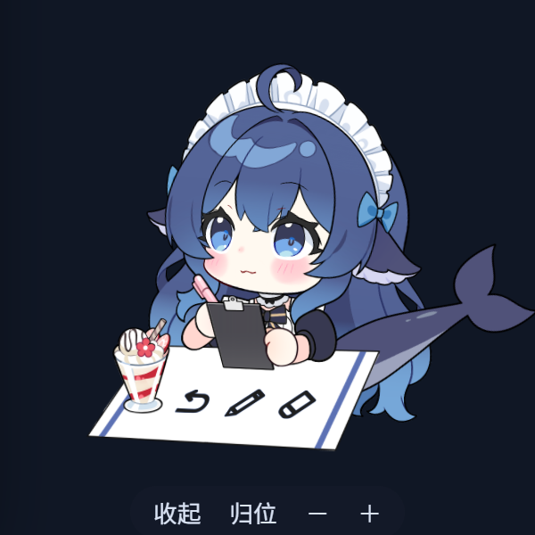
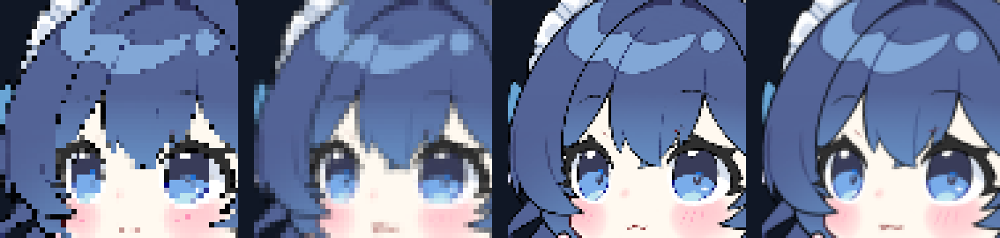

# dsh-live2d-pet — Live2D 桌宠插件

给 DSH Web GUI 挂一只 **Live2D 桌宠**：会呼吸、会眨眼、眼睛和脑袋跟着鼠标转，能拖着换位置，点一下有反应，右键面板里能播模型自带的**全部动作与表情**。

自带 **DS鲸鱼娘**（氵六青 的无偿分享模型）：8 组动作 + 44 个表情/道具。



## 功能

| 功能 | 说明 |
|---|---|
| Live2D 渲染 | PixiJS v8 + untitled-pixi-live2d-engine（Cubism 3/4/5），WebGL 透明画布，$O(1)$ 开销的常驻浮层 |
| 鼠标跟随 | 指针在窗口内移动时，模型的眼球/头部实时朝向指针；移开后视线自然回到中心 |
| 拖动与缩放 | 按住**角色身上**拖走；位置与尺寸存 localStorage，刷新后原样恢复 |
| 点击反应 | 点**头部** → 重锤出击 + 脸红 + 台词；点身上其它地方只出气泡，不挥锤 |
| 事件穿透 | 只有角色剪影吃鼠标事件，方形画布的透明区域**穿透**到底下页面，不挡 DSH 的 UI |
| 零常驻 UI | 画面上只有角色本身；UI 全在右键面板里，`Esc` 或点面板外关闭 |
| 右键面板 | **宠物身上点右键**呼出全部控制：动作 / 表情 / 换宠物 / 大小 / 归位。平时画面上**没有任何常驻 UI**，鼠标划过也不显示 |
| 动作面板 | 读取模型自己声明的 motion group，8 个动作一键播放 |
| 表情面板 | 44 个表情按「情绪 / 配件 / 道具」分类，到点自动归位 |
| 装扮面板 | 7 个互斥槽位（眼镜/贴纸/发饰/桌布/魔爪/桌面摆设/手部），每个单选，**跨槽位可同时生效** |
| 多宠物 | `%DSH_HOME%\pets\` 下所有 `renderer: live2d` 的宠物都会被扫描，面板里可切换 |
| 零配置宠物 | 宠物 = 一个目录 + `pet.json`；插件不硬编码任何模型 |

## 安装

```pwsh
dsh plugin --profile web add "link:D:\HTML\DSH_Pet_Live2d\dsh-live2d-pet"
# 或从目录安装
dsh plugin --profile web add "link:<本目录绝对路径>"
```

装完 **重启 `dsh web`**（新 bundle 不参与热重载）。

## 前置：Cubism Core 运行时（必做）

Live2D 的专有许可**不允许再分发** Core 运行时，所以本插件**永不内置、永不代下**它。请自行从 [Live2D 官方 Cubism SDK for Web](https://www.live2d.com/download/cubism-sdk/download-web/) 取得 `live2dcubismcore.min.js`，放到：

```
%DSH_HOME%\pets\.runtime\live2dcubismcore.min.js
```

缺这个文件时，宠物位置会显示一张安装指引卡（不会崩，也不影响其它插件）。本机已放好。

## v1.4 UI 重构

**画面上不再有任何常驻 UI，鼠标划过也不出现。** 所有功能收进**右键面板**。

| 之前 | 现在 |
|---|---|
| 鼠标划过宠物 → 浮出一条工具栏（面板 / 归位 / － / ＋） | 划过**什么都不显示**；宠物身上**点右键**呼出完整面板 |
| 工具栏浮在角色身上，挡住画面 | 面板在宠物旁边，不盖住角色 |
| 大小只能靠工具栏的 －/＋ | 面板底部：－ / 滑杆 / ＋ / 当前 px / 归位 |
| 关面板要点同一个按钮 | `Esc`、右上角 `×`、或点面板外任意处都能关 |

为什么去掉 hover：一是浮层压在角色身上很碍眼；二是**透明穿透的代理层没法好好表达 hover**——根节点是 `pointer-events: none`，`[data-hover]` 只能靠代理的 `pointerenter/leave` 手动维护，指针从宠物移到按钮上那段空隙还会让工具栏闪掉。右键没有这些问题：它是主动动作，而且要拦掉浏览器自带菜单（`preventDefault`），语义唯一。

面板只对**角色剪影**响应——在方形画布的透明角落点右键会照常穿透到页面，不会误开面板。

### 多槽位叠加（装扮）

引擎的表情管理器一次只持有**一个**表情（`expressionManager.currentExpression`），所以「眼镜 + 猫猫贴纸 + 深色桌布 同时戴」不能交给它。

**做法**：插件自己按帧写参数。每个表达式在自己的 .exp3.json 里声明了它要写的通道和混合方式（这个模型全是 `Add`），客户端把选中表达式的通道取并集交给控制器，控制器每帧叠加一次。

**关键是挂钩点**：写在 `loadParameters()` 之后是错的——那一帧的 `saveParameters()` 会把它一起快照进基线，于是下一帧恢复出来时已经含了它，再叠一次，**永远关不掉**（实测开关停在 1，取消选择也不回落）。正确的点是 `saveParameters()` **之后**：

```
每帧：loadParameters()（抹掉上一帧的表情层）→ 动作写参数 → saveParameters()（快照）
      → 我们写表情层 → 引擎算形变 → 绘制
```

引擎自己的表情流程就在 `saveParameters()` 之后，所以这就是同一层，只是没有「只能有一个」的限制。

实测（`cdp-merge`，全部从**真正的装扮面板**点出来）：

| 操作 | 结果（帧内参数） |
|---|---|
| 什么都不选 | `[0,0,0,0]` |
| 点圆眼镜 | `[1,0,0,0]` |
| 再点猫猫 | `[1,1,0,0]` —— 眼镜留着 |
| 眼镜槽选「无」 | `[0,1,0,0]` —— 猫猫留着 |
| 再加深色桌布 | `[1,1,1,0]` |

---

### 附：这一块踩过的测量陷阱

同一个问题我给出过**两次互相矛盾**的结论，都是被错误的测量方法带偏的，记下来免得重蹈：

| 方法 | 得到 | 我当时的结论 | 真相 |
|---|---|---|---|
| 冻结 rAF + 截图逐像素比对 | 每格 0.00% | 「表情全都不生效」 | 冻结不可靠，后面每格都在读同一张陈旧帧 |
| 比对 canvas 哈希 | `changed: true` | 「表情是好的，只是要等淡入」 | 宠物一直在呼吸眨眼，**任意两帧都不会逐字节相同**，信号恒为真 |

可靠的做法是读**引擎在帧内写进模型的参数值**：确定性、不受动画相位影响。`cdp-exp` 和 `cdp-merge` 现在都这么做。

顺带修的：`cdp-exp` 原本是个**打印型** driver——结尾无条件 `process.exit(0)`，从不判定，再加上它唯一的信号（canvas 哈希）恒为真，等于从来没有断言过任何事。现在它真的会失败。
## v1.3 修正（本次）

| # | 问题 | 原因 | 处理 |
|---|---|---|---|
| 1 | 重锤出击在摸鱼动画里也会播 | 摸鱼从「所有非待机动作」里随机抽，重锤出击与鲸鱼喷水都在池子里 | 加 `FIDGET_DENY` 拒绝表；宠物可用 `motionOptions[group].fidget` 覆盖 |
| 2 | 鲸鱼喷水同上 | 同上 | 同上 |
| 3 | 动作 / 表情播完不回初始待机 | `hold: true` 是**永久**定格；手动点的表情也永久钉住 | `ACTION_HOLD_MAX_MS`(9s) / `EXPRESSION_HOLD_MS`(12s) 两道时限 + `resetToRest()` 收口 |
| 4 | 没接上 DSH 会话流 | 订阅了 `tool/call`——那是**会话日志事件**，不是 cordis 事件，**永远不触发**；而且相位只播一次，长任务看着像没反应 | 改订 `tools/pre-execute` / `tools/post-execute`（瀑布事件，必须 `next()`）；`tool`/`done`/`failed` 改为 **sustain**，动作播完自动重播直到相位改变 |
| 5 | 整个方形画布都能拖动、挡住底下 UI | 元素即使全透明，只要 `pointer-events: auto` 就吃满整个盒子 | 根节点 `pointer-events: none` + 一层用 `clip-path: path()` 裁成剪影的**不可见代理**；透明处穿透（`mask-image` 不影响命中测试，只有 `clip-path` 会） |
| 6 | 点身上任何地方都挥锤 | 没有头部区域的概念 | 从**模型自己的五官 drawable** 量出头部包围盒（模型空间，随缩放/拖动自动跟随），只有点头部才触发重锤出击 |

### 为什么这些 bug 之前测不出来

回归套件的宿主是**假的**：`attachActivityEvents({ on: () => {} }, hub)` 传了一个空的 `on`，相位全靠 `/__nudge` 直接推 hub。于是**插件自己的事件订阅一行都没被验证过**——这正是 `tool/call` 那个 bug 能带着 10 个绿灯活下来的原因。

现在 harness 提供一个真的小事件总线 + `/__emit`，`cdp-host-events.mjs` 用**真实事件名**驱动并断言。新增 4 个 driver（共 14 个）：

| driver | 覆盖 |
|---|---|
| `cdp-host-events.mjs` | `tools/pre-execute` 有订阅者、会 `next()`、能推进相位；长相位持续播放；`tools/post-execute` / `agent/turn-stopping` 收尾 |
| `cdp-head.mjs` | 点头部播重锤出击 + 脸红；点身上不播；摸鱼池排除重锤/喷水 |
| `cdp-idle-return.mjs` | 表情 12s 自清；定格 9s 释放；`resetToRest()`；相位表情随相位清除 |
| `cdp-passthrough.mjs` | 四个角都穿透到页面；角落点击不触发反应、不拖动；角色上点击正常送达 |
## v1.2 交互与渲染优化

| 问题 | 原因 | 处理 |
|---|---|---|
| 放大后画面模糊 | 渲染缓冲固定 1x，画面被 CSS 拉伸 | `resolution = max(2, devicePixelRatio)`；实测 backing store 恒为 CSS 尺寸的 2–3 倍 |
| **缩小后线条发虚**（v1.2.1） | 两道叠加：① 2048² 图集被直接缩到 160–760px，而 `lod:"single-auto"` 只在 effectiveScale < 0.5 时才做 LOD——300px 时约 0.59，**这个分支根本没触发**，等于每个屏幕像素只从图集里抽 1 个纹素，细笔画被整根抽掉；② 画布 backing store 在 1x 屏上只有 160–760²，细线本身就落在采样点之间 | ① `lod:"full"` 建完整 mip 链（注意：`lod:false` 是"全分辨率但**不建** mip"，比 `"single-auto"` 更糟）+ `maxAnisotropy: 8`；② 渲染倍率下限提到 **2x** 做超采样。面部细笔画像素占比实测（300px）：原始 8.16% → 仅建 mip 3.89% → mip+2x 超采样 5.27%，断线/锯齿消失，细线恢复连续 |
| 画布空白处也能点到 | 整个方形 canvas 都在吃点击 | 从**实际渲染出的像素**提取 64×64 透明度网格，只有落在角色轮廓上才算点击 |
| 画布挡住底下的 UI（v1.3） | 元素即使透明，只要 pointer-events: auto 就会吃满整个盒子 | 根节点改成 pointer-events: none，另加一层**不可见代理**，用 clip-path: path(...) 把可点区裁成角色剪影（mask-image **不影响**命中测试，只有 clip-path 会影响）。透明处直接穿透到页面；代理轮廓按 hitsMask 的 ±1 格容差**膨胀一格**，两者严格重合 |
| 鼠标移开后视线不回正 | 视线停在"最后一个指针位置" | 超出注视范围即回到**模型默认中心位**（`data-gaze="center"`） |
| 不接会话状态 | 只响应点击 | 宿主订阅 `agent/status` / `agent/turn-stopping` / `agent/error` / `approval/request`，经同源 SSE 推送；客户端按相位切换动作与表情 |
| 打开设置面板宠物被放大 | **真 bug**：`layout()` 用了 `model.width`，而 Pixi 的 `Container.width` 返回的是**当前缩放后**的尺寸，于是每次重排都把缩放自乘一次 | 启动时缓存**未缩放**原始尺寸，之后一律由它计算；面板开合不再影响画面 |
| 待机太死板 | 没有随机行为 | 静置 12–26 秒后随机播一个非待机动作（"摸鱼"），播完自动回待机；任何交互都会重置计时。**重锤出击与鲸鱼喷水不在摸鱼池里**——它们是「点头」和「出错」的专属反应，被随机播出来就像宠物在回应一件根本没发生的事（`FIDGET_DENY`，宠物可用 `motionOptions[group].fidget` 覆盖） |

### 缩小时的锐度（v1.2.1）



上图为 3 倍最近邻放大的面部区域，顺序是 **旧 160px ｜ 新 160px ｜ 旧 300px ｜ 新 300px**。旧的渲染里发丝是断续的虚线状、轮廓边上有明显的方块感；新的渲染线条连续、边界干净。

三处改动：

| 项 | 旧 | 新 | 为什么 |
|---|---|---|---|
| 纹理采样 | `lod: "single-auto"` | `lod: "full"` | `"single-auto"` 只有 effectiveScale < 0.5 才生效；300px 宠物约 0.59，**这条分支从未触发**，等于只做双线性点采样。`"full"` 才会让资源加载器生成完整 mip 链（注意 `lod:false` 是"全分辨率但**不建** mip"，比 `"single-auto"` 更差） |
| 各向异性过滤 | 无 | 各向异性 8x | 引擎不会把 `textureOptions.maxAnisotropy` 传给采样器，必须在加载后写到每张纹理的 style 上；它负责斜向线条（刘海、缎带边缘）在斜视时不糊成一片 |
| 渲染倍率 | `min(3, devicePixelRatio)`，1x 屏就是 1x | `min(3, max(2, devicePixelRatio))` | 这是最有效的一招：1x 屏上 300px 画布只有 300² 采样点，无论纹理怎么筛，输出就只有这么多样本。下限提到 2x 等于**超采样**（每个显示像素 4 个渲染样本），再由浏览器缩回 CSS 尺寸 |

实测（300px，面部细笔画像素占该区域的比例）：**旧 8.16% → 仅建 mip 3.89% → mip + 2x 超采样 5.27%**。纯 mip 化会把细线"抹平"（数字反而比旧的低），所以两者必须一起上；超采样把细节拉回来，mip 链保证缩小时不出现摩尔纹和闪烁。

### 表情（v1.2.2）

44 个表情此前**全部加载失败**：`model3.json` 里指向的是中文文件名（`expressions/脸红.exp3.json`），而磁盘上按 manifest 路径校验的要求已经改成了 ASCII slug（`facial-red.exp3.json`）——生成器改过，但改完没有重新跑，装到 `%DSH_HOME%` 的那份是旧的。`build-pet.mjs` 现在会**保留手写文件**（`pet.json` / `catalog.json` / `README.md` / `voice.json`），重跑不会再把这些删掉，可以安全地反复执行。

还有一处命名不一致：`哭.exp3.json` 在 `model3.json` 里声明的 `Name` 是 **"大哭"**。表情查找按 `Name` 而非文件名匹配，所以 `failed` 相位原本写的 `"哭"` 永远查不到、静默什么都不做。现已修正为 `大哭`。

### 会话状态映射（v1.3 修正）

宿主把 DSH 的真实事件折叠成一个粗粒度相位并推送：

| 事件 | 相位 | 默认动作 | 默认表情 | 持续播放 |
|---|---|---|---|---|
| `agent/status` → running | thinking | 待机 | 呆呆眼 | 否（待机本身就在循环） |
| `approval/request` | waiting | 待机 | 问号 | 否 |
| **`tools/pre-execute`** | tool | 挤番茄酱 | 流汗 | **是** |
| `agent/turn-stopping` | done | 吹泡泡糖 | 情绪花花 | **是** |
| `agent/error` | failed | 鲸鱼喷水 | 大哭 | **是** |

> **为什么会话流之前「没接上」**：`tool/call` **不是** cordis 生命周期事件，而是写进会话记录（transcript）的**日志事件**——`ctx.on('tool/call')` 永远不会触发，所以工具活动对宠物完全不可见。真正的挂钩点是 `tools/*` 瀑布事件（`tools/pre-execute` / `tools/post-execute` / `tools/execute`），它们带着 `ToolExecution` 本身。瀑布事件**必须**调用 `next()`，否则会把整条链断掉，所以订阅器把它包在 try/catch 里、异常时也继续 `next()`。

**工具相位不抖动**：一轮对话里往往连着跑很多个工具。如果每次工具返回就立刻退回 `thinking`，相位会一秒翻好几次、动画跟着不停重启。所以退回是**防抖**的——只有在工具真的不再来了（`TOOL_IDLE_MS` = 1.2s 内没有新工具）之后才退回。

**持续播放**：相位是**状态**而不是一次性事件。`tool` / `done` / `failed` 会由控制器的 sustain 循环在动作播完后自动重播，直到相位改变——否则一个跑了 30 秒的工具调用只会看到 5 秒动画然后回到待机，看起来就像「没反应」。`thinking` / `waiting` 落在待机循环上，本身就在动，不重复触发（否则只会显得抽搐）。

可被宠物自己在 `pet.json` 的 `live2d.motions` / `live2d.expressions` 里覆盖（键就是这些相位名）。相位到达时若宠物正在演用户触发的反应，会**延后到回待机再补播**，不会丢掉状态；SSE 断开时会**解除 sustain**，不会永久卡在某个相位。

### 回到待机（v1.3）

要求是「所有动作、表情在播完一段时间后都要**完全**切回初始待机」。三件事共同保证：

| 情形 | 上限 | 说明 |
|---|---|---|
| 普通动作 | 动作自身 `Duration` | 播完即回待机循环 |
| `hold: true` 的定格 | `ACTION_HOLD_MAX_MS` = 9s | 定格**不是永久的**：先定格一会儿让人看清，然后交还身体并还原参数 |
| 手动点的表情 | `EXPRESSION_HOLD_MS` = 12s | 到点自动清除，面板的高亮也跟着消失 |
| 会话相位表情 | 跟相位同寿 | 相位离开时清除 |

`resetToRest()` 是唯一的收口：清 sustain、还参数、回待机循环。「归位」按钮走的就是它。

### 观测契约

宠物根节点上有三个属性，便于排查与自动化测试：

- `data-motion` — 当前动作组（待机为 `idle`）
- `data-gaze` — `center`（回默认位）/ `pointer`（跟随鼠标）
- `data-phase` — 最近一次会话相位

另外 `window.__dshLive2dPet` 暴露了动作控制器（`maskInfo()` 可查看点击轮廓、`playOnce()` / `playIdle()` 可手动驱动），方便在控制台排查。

### 关于 HitAreas

本模型**没有**声明 Cubism HitAreas，所以点击判定不依赖引擎的 `hitTest`，而是从渲染结果的 alpha 通道提取轮廓——因此任何模型都能用，无需作者额外导出命中区。

## 动作状态机

Live2D 的 `MotionManager` 有三处反直觉行为，直接裸调 `model.motion()` 会出现「点一下就一直循环播放」这类问题。插件用一个状态机统一接管动作生命周期：

| 引擎行为 | 后果 | 处理 |
|---|---|---|
| 同 group+index 正在播放时拒绝再次启动 | 连点没反应 / 只能播一次 | 每次启动前先 `stopAllMotions()` |
| `NORMAL` 优先级不能打断 `NORMAL` | 第一次动作后宠物「死」了，后续全被静默拒绝 | 互动与面板动作用 `FORCE`，待机用 `IDLE` |
| `motion()` 是**异步**的：先 `stopAllMotions()` 再加载入队，这中间 `MotionManager.update` 会看到 `playing && isFinished()` 并**误发 `motionFinish`** | 新动作刚开始就被判定「播完了」，瞬间弹回待机 | 忽略启动后 250ms 内到达的 `motionFinish` |
| 动作自带 `"Loop": true` 时永不结束，也就永不触发 `motionFinish` | 动作无限循环，回不到待机 | 宿主从 `motion3.json` 读出 `Duration`/`Loop`，按声明的时长定时收尾 |

因此状态机只做三件事：**常驻待机循环** → **播一次动作** → **自动回待机**，且每一步都可被打断。

宿主半区会把每个动作的 `duration`（毫秒）、`loop` 以及**该动作写了哪些参数**（来自模型自己的 `motion3.json`）随 catalog 下发，所以换任何模型都能自适应，不需要改插件代码。

### 动作语义（v1.2.2）

引擎还有一条更隐蔽的行为，是「吹泡泡吹完嘴不还原」的根因：

> **动作结束后，它写过的参数没有任何人负责还原。** 引擎在动作播放期间往模型参数里写值，停下就只是「不写了」——参数留在最后一帧的值上。平时看不出问题，是因为待机循环恰好也在驱动这些参数；而本模型的动作专属参数（`chuipaopao*`、`phone*`、`pengshui`…）**待机完全不碰**，于是动作一停，最后的嘴形就永久留在脸上。

插件现在的做法：动作启动前把它会写的参数**快照**下来，回待机时**还原**。参数名单由宿主从 `motion3.json` 的 `Curves` 里读出并下发。

另外全部动作现在都以 `loop: false` 启动。引擎的合并方式是 `setLoop(调用方的 loop ?? 动作自带的 Meta.Loop)`，而本包**所有** `motion3.json` 都写着 `"Loop": true`，所以不显式传 `false` 的话动作永远不结束，也就永远摆不出「定格」姿势。

剩下三件事是模型作者才知道的意图，写在 `pet.json` 的 `live2d.motionOptions` 里：

| 声明 | 含义 | 解决的问题 |
|---|---|---|
| `{"hold": true}` | 动作播完**定格**在最后一帧；最多 `ACTION_HOLD_MAX_MS`（9s）后交还身体 | 掏出手机后手机能拿在手里看一会儿，但不会永远举着 |
| `{"fidget": false}` | 不参与随机摸鱼 | 把手交互类动作排除出摸鱼池 |
| `{"prepend": "OpenCase"}` | 先播前置动作，再播真正的动作 | 自拍的 `phone` 第一帧就是 1（作者假定手机已在手），不先掏手机就是在对着空气自拍 |
| `{"preset": {"jingyu": 1}}` | 动作本身没写、但这个动作需要被一起点亮的参数 | 鲸鱼喷水这个动作只写了 `pengshui`（碰水），真正负责「喷」的鲸鱼是另一个参数 `jingyu`，不点它看起来就是毫无反应 |

定格姿势**不算「忙」**（`isPlaying()` 返回 false）：否则点一次掏出手机就会永久压住待机摸鱼和会话相位，宠物就此卡死。它只是「看起来不一样的待机」，任何新动作都能接管。

宠物根节点带 `data-motion` 属性（待机时为 `idle`），方便直接观察当前状态。

## 宠物契约

一个宠物目录长这样：

```
%DSH_HOME%\pets\<id>\
  pet.json          # 清单（renderer: live2d）
  c_0120.model3.json
  model\            # .moc3 / physics3 / cdi3
  textures\         # 贴图
  motions\          # .motion3.json
  expressions\      # .exp3.json
  catalog.json      # 可选：动作/表情的中文名与分类
```

`pet.json`：

```jsonc
{
  "petManifestVersion": 2,
  "id": "ds-whale-girl",
  "displayName": "DS鲸鱼娘",
  "renderer": "live2d",
  "license": "...",                  // 资产授权声明
  "live2d": {
    "model": "c_0120.model3.json",   // 相对于本目录
    "scale": 1,                      // 在自适应缩放上乘算
    "translate": { "x": 0, "y": 0 }, // 像素偏移
    "motions":  { "idle": "Idle" },  // 可选；插件主要用模型自带列表
    "expressions": { "idle": "脸红" },
    // 可选；模型自己表达不了的「作者意图」，见《动作语义》
    "motionOptions": {
      "OpenCase":   { "hold": true },
      "Selfie":     { "prepend": "OpenCase" },
      "SprayWater": { "preset": { "jingyu": 1 } }
    }
  }
}
```

`motionOptions` 的三个键都可以组合；不写就是默认行为（播一次然后回待机）。`prepend` 的前置动作同样受该动作自己的 `motionOptions` 约束。

`catalog.json`（可选，只影响显示名）：

```jsonc
{
  "motions":     [{ "key": "Hammer", "label": "重锤出击", "category": "action" }],
  "expressions": [{ "key": "脸红",   "label": "脸红",     "category": "emotion" }]
}
```

**动作和表情列表以 `c_0120.model3.json` 里声明的为准**，插件启动时从模型读出，所以换模型 / 改模型文件立刻生效，不用改插件代码。

## 宿主 HTTP 接口

| 方法 | 路径 | 说明 |
|---|---|---|
| GET | `/api/live2d-pet/catalog` | 已安装宠物 + 各自的动作/表情清单 + 运行时 URL |
| GET | `/api/live2d-pet/asset/<id>/<path>` | 只服务 `model3.json` **引用闭包**内的文件（白名单 Set 比对 + realpath 包含，`..` 永远匹配不上） |
| GET | `/api/live2d-pet/runtime/live2dcubismcore.min.js` | 用户自备的 Cubism Core |
| GET | `/api/live2d-pet/runtime/live2d-vendor.js` | 插件内置的 MIT vendor 分包（pixi.js + 引擎），按需懒加载 |

API 与资产路由默认只答本机回环请求。

## 架构

```
dsh-live2d-pet/
  package.json          dsh.client.platform = web -> 双半区包
  cordis.patch.yml      bundle patch：插一行 live2d-pet
  lib/
    index.js            宿主半区：宠物发现 / 引用闭包资产路由 / 运行时分发
    client.js           浏览器半区：手写 __ModuleLoader__ 工厂，无构建步骤
    live2d-vendor.js    pixi.js + untitled-pixi-live2d-engine 的 IIFE（esbuild 产物）
  src/vendor-entry.ts   vendor 分包入口（npm run build:vendor 重新生成）
```

Vendor 分包**懒加载**：只有真正挂载 Live2D 宠物时才注入 `live2d-vendor.js`，页面首屏不为它买单。

## 二次开发

```pwsh
npm install                 # pixi.js / untitled-pixi-live2d-engine / esbuild
npm run build:vendor        # 重新生成 lib/live2d-vendor.js
```

改完 `lib/client.js` 后**重启 `dsh web`**（bundle 不做热重载）。

回归测试在仓库的 `tools/browser-test/`：无头 Edge + CDP，在真实 WebGL 里跑完整契约。
```bash
cd ../../tools/browser-test && npm install && npm run suite
```

## 许可

- 插件代码：MIT
- vendor 分包：pixi.js（MIT）+ untitled-pixi-live2d-engine（MIT），可随包分发
- Cubism Core：Live2D 专有，**用户自备，本插件不内置**
- DS鲸鱼娘模型：版权归 **B站@氵六青**，无偿分享 —— 商用直播 ✓、自印物料 ✓、**禁止盗用与出售**。
  已获作者转载授权，随本仓库一起分发。模型版权与本插件许可无关。